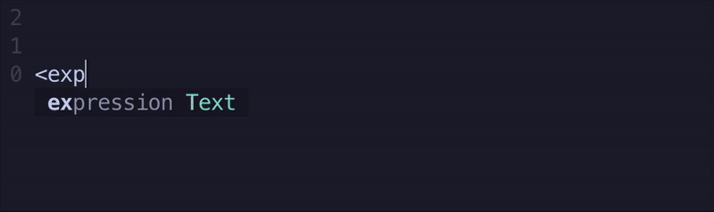

# bnf-syntax.nvim

Simple syntax highlighting for BNF (Backus-Naur Form) grammar files in Neovim.

## Demo




## Installation

### Lazy.nvim
```lua
{
  "adamkleo/bnf-syntax"
}
```

### Packer
```lua
use "adamkleo/bnf-syntax"
```

## Usage

The plugin automatically detects `.bnf` files and applies syntax highlighting. No configuration required.

Example BNF syntax that will be highlighted:
```bnf
<expression> ::= <term> | <expression> "+" <term>
<term> ::= <factor> | <term> "*" <factor>
<factor> ::= "(" <expression> ")" | <number>
```

## Configuration

Optionally customize the filetype and extension:

```lua
require("bnf-syntax").setup({
  filetype = "bnf",
  extension = "bnf"
})
```
The extension option is used to match files ending with the chosen extension. The filetype option sets the filetype of the matched files. By default, these values are both "bnf"

## License

MIT
